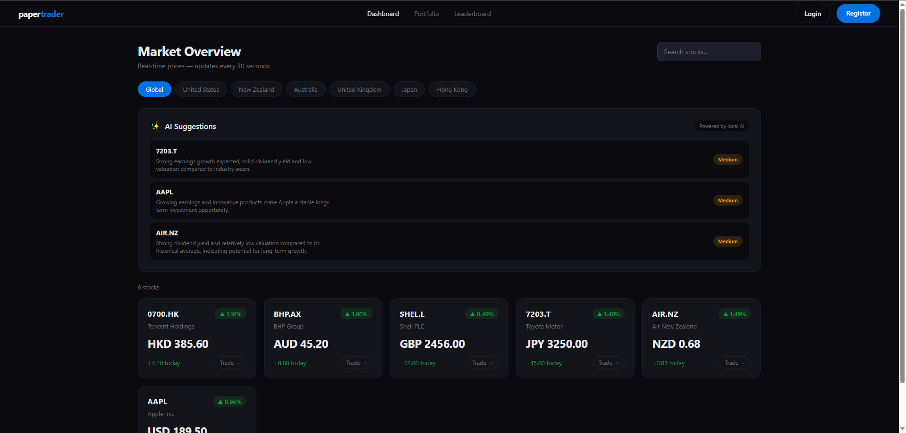
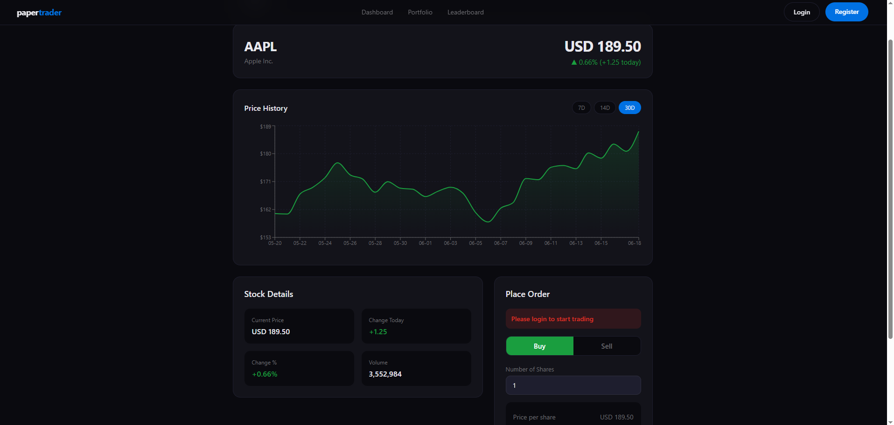
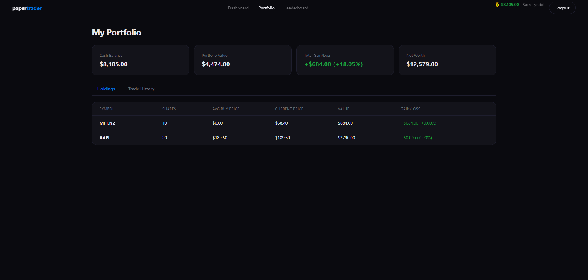
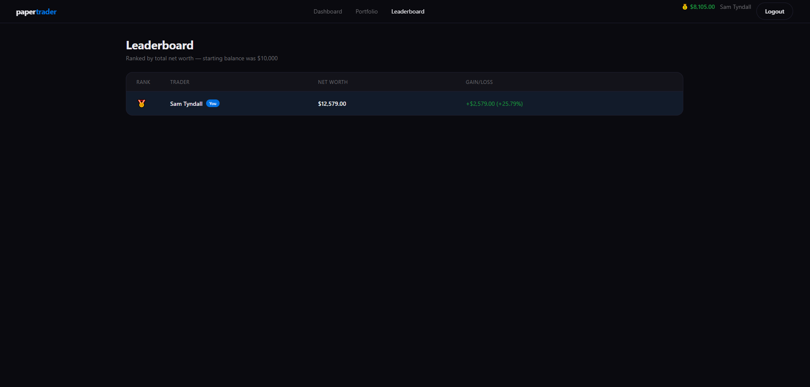

# papertrader

A full-stack paper trading web application with real-time stock prices, AI-powered suggestions, and a competitive leaderboard — built with Java Spring Boot, React, and PostgreSQL.



## Overview

papertrader lets users practice stock trading with virtual money. Every account starts with $10,000 in cash, and users can buy and sell real stocks across six global markets at live prices, track their gains and losses in real time, and compete with other traders on a leaderboard.

## Features

- Real-time stock prices across US, NZ, AU, UK, JP and HK markets
- Buy and sell stocks with virtual currency
- Live portfolio tracking with gains/losses
- Interactive price history charts
- AI-powered stock suggestions using a locally hosted LLM (Ollama)
- Trade history log
- Leaderboard ranking users by net worth
- Fully responsive design with mobile navigation

## Tech Stack

**Backend**
- Java 21, Spring Boot 3.5
- Spring Security (authentication)
- Spring Data JPA / Hibernate
- PostgreSQL

**Frontend**
- React 18 (Vite)
- React Router
- Recharts (data visualisation)
- Axios

**AI**
- Ollama (local LLM, Llama 3.2) for stock suggestions

**Stock Data**
- Alpha Vantage API (with offline mock data fallback)

## Screenshots

### Dashboard


### Trade Page


### Portfolio


### Leaderboard


## Getting Started

### Prerequisites

- Java JDK 17+
- Maven
- PostgreSQL
- Node.js 18+
- [Ollama](https://ollama.com) (for AI suggestions)
- An [Alpha Vantage](https://www.alphavantage.co/support/#api-key) API key (free tier)

### Backend Setup

1. Clone the repository
```bash
   git clone https://github.com/YOUR_USERNAME/paper-trader.git
   cd paper-trader/app
```

2. Create a PostgreSQL database
```sql
   CREATE DATABASE papertrader;
```

3. Create `src/main/resources/application-secrets.properties`
```properties
   DB_USERNAME=your_postgres_username
   DB_PASSWORD=your_postgres_password
   ALPHA_VANTAGE_KEY=your_api_key_here
```

4. Pull and run an Ollama model
```bash
   ollama pull llama3.2
```

5. Run the backend
```bash
   ./mvnw spring-boot:run
```

   The backend runs on `http://localhost:8082`

### Frontend Setup

1. Navigate to the frontend folder
```bash
   cd ../frontend
   npm install
```

2. Run the dev server
```bash
   npm run dev
```

   The frontend runs on `http://localhost:5173`

## Project Structure

paper-trader/

├── app/                              Spring Boot backend

│   └── src/main/java/com/papertrader/app/

│       ├── controllers/              REST API endpoints

│       ├── models/                   Database entities

│       ├── repositories/             Database queries

│       ├── services/                 Business logic, stock data, AI

│       └── SecurityConfig.java

└── frontend/                         React frontend

└── src/

├── components/               Navbar, StockCard, charts, AI widget

├── pages/                    Dashboard, Trade, Portfolio, Leaderboard

├── context/                  Auth state management

└── services/                 API calls to backend

## Database Schema
users         — id, name, email, password, balance, created_at

portfolios    — id, user_id, symbol, shares, avg_buy_price

trades        — id, user_id, symbol, type, shares, price, total, created_at

watchlist     — id, user_id, symbol, added_at

## How It Works

Each user starts with $10,000 virtual balance. When buying a stock, the app fetches the live price, deducts the cost from the user's balance, and records the holding in their portfolio along with an average buy price. Selling works in reverse, crediting the sale value back to the balance. The leaderboard ranks all users by their total net worth (cash balance + current portfolio value).

AI suggestions are generated by sending current market data to a locally running Ollama instance, which returns three stock picks with reasoning and a confidence rating — entirely free with no API costs.

## License

This project is open source and available under the [MIT License](LICENSE).